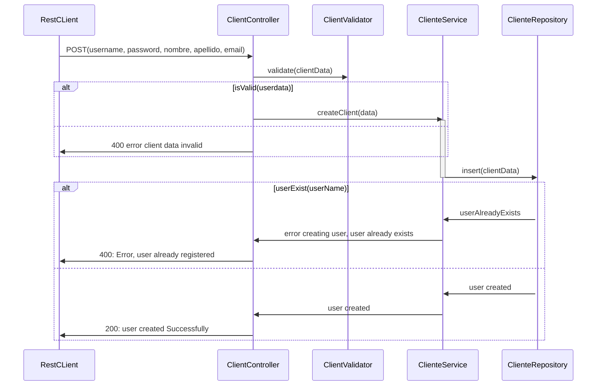
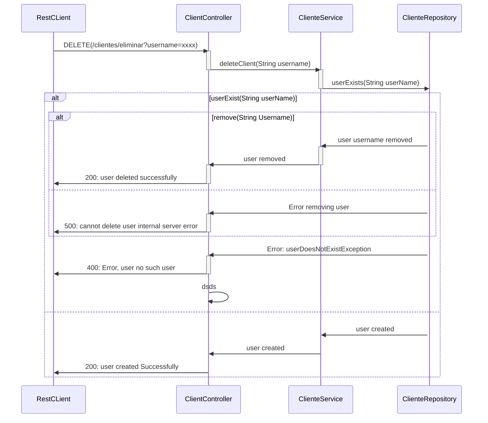

#Documentation
## Sequence digrams exercise

- POST create client

```mermaid
sequenceDiagram

    participant RC as RestCLient
    participant C as ClientController
    participant V as ClientValidator
    participant S as ClienteService
    participant R as ClienteRepository
    RC->>C: POST(username, password, nombre, apellido, email)
    C->>V: validate(clientData)
    alt isValid(userdata)
    C->>S: createClient(data)
    activate S
    else
    C->>RC: 400 error client data invalid
    end
    S->>R: insert(clientData)
    activate R
    deactivate S
alt userExist(userName)
R->>S: userAlreadyExists
S->>C: error creating user, user already exists
C->>RC: 400: Error, user already registered
else
R->>S: user created
S->>C: user created
C->>RC: 200: user created Successfully
end

```
- DELETE Client

```mermaid
sequenceDiagram
    participant RC as RestCLient
    participant C as ClientController
    #participant V as ClientValidator
    participant S as ClienteService
    participant R as ClienteRepository
    RC->>C: DELETE(/clientes/eliminar?username=xxxx)
    activate C
    C->>S: deleteClient(String username)
    deactivate C
    activate S
    S->>R: userExists(String userName)
    activate R

    deactivate S
alt userExist(String userName)
alt remove(String Username)
R->>S: user username removed
activate S
S->>C: user removed
activate C
deactivate S
C->>RC: 200: user deleted successfully
deactivate C
else
R->>C: Error removing user
activate C
C->>RC: 500: cannot delete user internal server error
deactivate C
end
R->>C: Error: userDoesNotExistException
activate C
C->>RC: 400: Error, user no such user
deactivate C
C->>C:dsds
else
R->>S: user created
S->>C: user created
C->>RC: 200: user created Successfully
end
```

